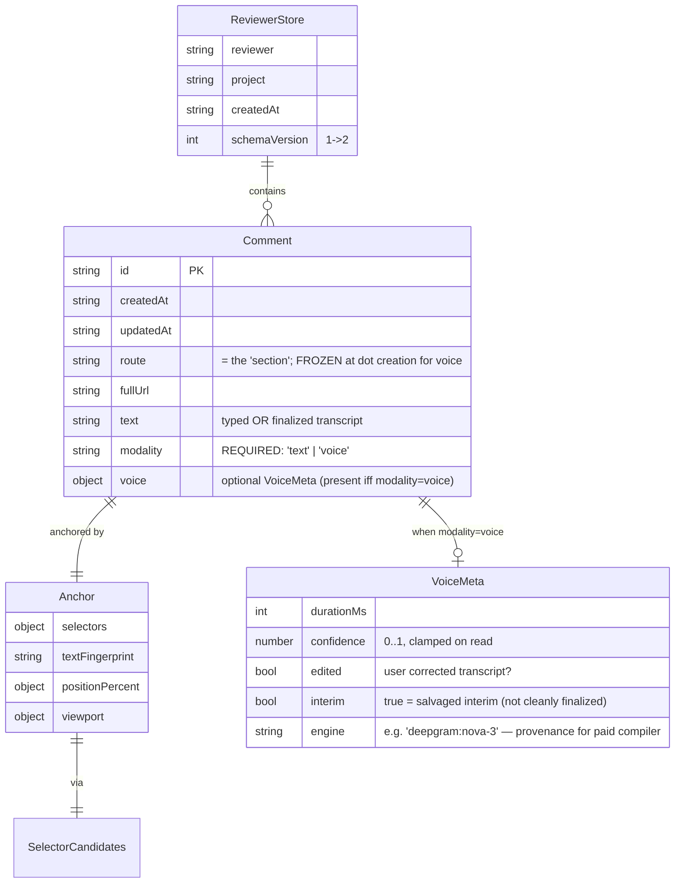

# ✨ Voice + Stealth Feedback Annotation Layer (pinflow v2)

> **AI tooling note:** Researched with Claude Code (Opus 4.8, 1M ctx) on 2026-06-20 via parallel
> repo/learnings/external-docs agents, then **deepened** with 8 specialist review agents (security,
> async-races, performance/bundle, architecture, simplicity, TypeScript, data-integrity, external
> patterns). Deepgram security facts and gesture/audio patterns are citation-backed (see Sources).
> Voice-capture, ephemeral-token, and pointer-gesture code from this plan must get human review.

## Enhancement Summary (deepened 2026-06-20)

**Sections enhanced:** Architecture (+ Bundling Constraints, + Performance & Bundle Budget, + core↔voice
contract), Data Model & Migration, Config surface, Security (+ Egress contract), State Lifecycle
(+ Async Resumption Contract), Phases, Risks, Integration Tests, + new "Deferred to v2.1".

**Key improvements from review:**
1. **Resolved a plan-breaking bundling issue** — `tsup` `splitting:false` (tsup.config.ts:17) + the
   IIFE/CDN global build cannot resolve a bare dynamic `import('pinflow/voice')`. Fixed via an injected
   `loadVoice` seam + a CI grep assertion that voice symbols are absent from core bundles.
2. **Made async safety first-class** — a generation-counter + AbortController + "release-on-stale-resume"
   contract replaces hand-wavy "tear down on route change" prose. The existing engine is fully
   synchronous; every new await resolves into a world that may no longer exist.
3. **Closed real data-loss vectors** — guarded `setItem` (quota/private-mode), forward-version tolerance
   (a v1 build must not wipe v2 data), corrupt-blob quarantine, multi-tab merge. Fixed a bug in the
   migration snippet (it dropped `modality`).
4. **Hardened security** — dev-token throws off-localhost; recording indicator + third-party consent
   despite "stealth"; an egress/data-minimization allowlist; markdown-injection escaping in export.
5. **Tightened scope** — cut `prerecorded.ts`, `desktopModifier`, dual move-thresholds, `model`/`language`
   config; deferred the paid-compilation contract doc (kept the `onSubmit` seam).
6. **Set concrete budgets/types** — voice entry ≤14 KB gz; `modality` required + `isVoiceComment` guard;
   `devOnlyToken` rename; all wire input parsed as `unknown`.

**New considerations discovered:** AudioContext is a capped resource (leaking it eventually throws);
`setPointerCapture` suppresses host scroll (don't capture eagerly); interim Deepgram results can arrive
*after* finalize (need a terminal "ignore-all" state); reviewer-name keys aren't collision-proof.

---

## Overview

Pinflow v1 is a Figma-style **pin-and-comment** layer for vibe-coded prototypes: a reviewer clicks an
element, drops a numbered pin, types a comment, and exports a markdown file engineered to paste straight
into Claude Code / Cursor. It is a zero-backend, zero-dependency, MIT browser library with a CI-enforced
30 KB-gzip ceiling (`package.json:111-124`, currently ~8 KB), and its core engine — Shadow-DOM overlay,
percentage anchoring, rAF reflow, collision-flipping, SPA route-watching — is already built and reusable
(`src/core/ui/annotator.ts`, `src/core/anchor.ts`).

**This plan adds the v2 that the v1 spec explicitly deferred** (`specs/pinflow_v1_spec.md §12`):

1. **Voice feedback** — long-press / `Alt`+click drops a feedback dot; the reviewer speaks; a live
   transcript streams onto the screen next to the dot; the transcript (+ its element/route anchor) is
   stored and exported. Powered by Deepgram streaming STT (`nova-3`).
2. **Stealth activation** — the layer is invisible until the reviewer performs a deliberate gesture
   (long-press on touch, `Alt`+click on desktop, keyboard fallback for a11y), so it sits "behind the
   screen" and is non-intrusive. *Stealth applies to review chrome — never to the fact that the mic is
   recording.*
3. **Per-screen feedback that compiles to fixes** — every note carries a `{route, element-anchor}`
   identity, so the markdown export groups feedback by screen and area, and (paid tier) an LLM compiles
   cross-reviewer feedback into a Claude-Code-ready change list.
4. **Free vs paid preserved** — the OSS library stays free and useful (BYO Deepgram token, markdown
   export). A hosted paid tier adds token-minting, cross-reviewer aggregation, and LLM compilation.

**First practical use case:** Sensavera (formerly ShareVoice) sends partners sample **sensagrams** with
a `test-flag`. With pinflow embedded in stealth+voice mode, partners leave targeted voice/text feedback
tied to specific screens and components; that feedback is compiled into precise, actionable fixes for the
engineering agents. Pinflow is deliberately **framework-agnostic** — Sensavera is the first host, not the
only one.

## Problem Statement

Today there is no low-friction way to collect **screen-specific, component-anchored** feedback from
partners reviewing a live experience. Forms and email lose the "where on the screen" context; screen
recordings aren't actionable by a coding agent. Reviewers also don't want to *type* — voice is faster and
richer, especially on mobile. And the activation must be invisible: a partner reviewing a polished demo
should not see review chrome unless they intend to leave feedback.

Pinflow already solves the **anchoring + export** half of this (click → pin → markdown for Claude Code).
What's missing: **voice capture/transcription**, an **unobtrusive activation gesture**, and a
**compilation path** that turns many anchored notes into a digestible change set — all without breaking
pinflow's load-bearing principles (zero-deps core, 30 KB ceiling, "nothing leaves the device unless the
builder configures it").

## Proposed Solution

A two-layer architecture that keeps the free core pristine and isolates everything network/audio in a
**lazy-loaded, opt-in `pinflow/voice` entry**:

- **Core (`src/core/**`, free, zero-deps, ≤30 KB):** extend the existing `Annotator` engine with (a) a
  **stealth gesture state machine** (pure DOM, no deps — fits in core) and (b) an extended data model
  (`modality`, `transcript`, `voice` metadata). Text feedback via stealth gesture works fully with **zero**
  new dependencies and **zero** network.
- **Voice module (`src/voice/index.ts`, new export `pinflow/voice`, opt-in, separately size-budgeted):**
  hand-rolled Deepgram WebSocket client (the `@deepgram/sdk` is ~50 KB+ — too heavy; confirmed),
  AudioWorklet PCM capture, waveform, and the streaming-transcript dot UI. Core loads this module **only**
  when `voice` is configured *and* a gesture fires (via an injected `loadVoice` seam — see Bundling
  Constraints) — so vanilla/text users never download it and SSR never touches it.
- **Security:** the library **never** holds a Deepgram API key. It accepts a `tokenEndpoint` (or, for
  local dev only, an opaque `devOnlyToken`) and connects with a short-lived **grant-token JWT** via the
  WebSocket subprotocol (`new WebSocket(url, ['token', jwt])`). Hosted (paid) mode points `tokenEndpoint`
  at a Sensavera-run minting endpoint that proxies Deepgram's `POST /v1/auth/grant` (TTL ≤60 s,
  `usage::write`, per-reviewer rate-limited, CORS-restricted).
- **Compilation:** the **free** path needs **no LLM key** — the markdown export *is* the LLM-digestible
  artifact, grouped by screen/element, pasted into Claude Code/Codex. The **paid** path adds server-side
  LLM compilation; the LLM key lives only in that paid backend, never in the browser.

## Decision Log (answers to the four framing questions)

1. **Activation gesture.** Long-press (touch, 500 ms, cancel on ~10 px move) + `Alt`+click (desktop) +
   keyboard fallback. **Pressure/force-touch is explicitly NOT used** — `PointerEvent.pressure` reads
   `0`/`0.5` on most hardware and Apple removed 3D Touch; it would be an unreliable primary. `Alt` is the
   least cross-OS-colliding modifier (avoid Ctrl/Cmd/right-click). *Decision (simplicity review): ship a
   fixed `Alt`+click — no `desktopModifier` option — and a single internal move-threshold constant.*
2. **"Stays on screen while the section is active."** In a framework-agnostic library, "section" = **route
   key** (`src/core/route-key.ts`). Pinflow already scopes pins per-route and re-renders on SPA navigation
   (`src/core/router.ts`); the feedback dot + transcript bubble persist while on that route, hide on
   navigate-away, and re-show on return. We reuse the route scope. *A voice session's route is **frozen at
   dot creation** — finalize persists against that captured route, never a fresh `routeKey()` (see Async
   Resumption Contract).*
3. **Deepgram key + LLM key.** Ask for a **Deepgram token** (BYO `tokenEndpoint` free / hosted-minted
   paid) — never a raw key in client code. **No LLM key is needed for the free tier**; markdown export
   feeds Claude Code directly. An LLM key is a **paid, server-side** concern for the compilation backend
   only.
4. **Free vs paid.** Free OSS core = pin/text/voice + per-screen markdown export, BYO Deepgram,
   localStorage, no hosted backend. Paid hosted = token minting (no BYO key), cross-reviewer aggregation +
   LLM compilation + hosted storage + sharable reports + the test-flag campaign embed.
   - **Entitlement invariant (architecture review):** the OSS core and `pinflow/voice` contain **zero**
     entitlement, billing, licensing, or tier-checking logic. There is no `tier`/`plan`/`licenseKey`/
     `isPaid` field anywhere in `PinflowConfig` or the data model. Free vs paid is realized *entirely by
     what the builder wires up* — a `tokenEndpoint` that happens to be hosted, and an `onSubmit` that
     happens to post to an aggregation backend. The library cannot tell free from paid and must never try.
     This keeps the boundary a product/deployment boundary, not a feature flag.

## Technical Approach

### Architecture

```
src/
  core/                         # FREE, zero-deps, ≤30 KB gz (CI-enforced)
    types.ts                    # + modality/voice fields + isVoiceComment guard; SCHEMA_VERSION 1→2
    voice-contract.ts           # NEW — TYPES ONLY: VoiceHost / VoiceModule / VoiceSession / providers
    storage.ts                  # migrate(unknown); guarded setItem; forward-tolerant load; multi-tab merge
    ui/annotator.ts             # engine: gesture controller; dot UI; loadVoice seam; dispose voice session
    gesture/
      controller.ts             # unified capture-phase pointer state machine (idle→pressing→activated)
                                #   (absorbs the existing `annotating` toggle flag; may inline activation)
    index.ts                    # ESM entry: PinflowConfig + injects loadVoice = () => import('pinflow/voice')
    iife.ts                     # CDN entry: constructs Annotator WITHOUT loadVoice → voice statically
                                #   unreachable; optional script-injection fallback for CDN voice
  voice/                        # NEW opt-in entry `pinflow/voice`, ≤14 KB gz budget, zero-deps, pure-on-import
    index.ts                    # default export implements VoiceModule (satisfies the contract)
    capture/
      audio.ts                  # AudioWorklet 16kHz mono linear16 PCM (port useAudioCapture.ts); iOS handling
      pcm-processor.ts          # worklet source, inlined as a Blob URL; downsample off-thread; transfer ArrayBuffer
      levels.ts                 # AnalyserNode → 5-band waveform levels (release valve if budget tight)
    transcription/
      provider.ts               # TranscriptionProvider interface (degrade ladder: deepgram → webspeech → text)
      deepgram.ts               # first impl: hand-rolled streaming WS client (subprotocol token auth)
      protocol.ts               # KeepAlive / Finalize / CloseStream + Results parsing (parse as unknown)
      token.ts                  # fetch grant-token JWT from tokenEndpoint (validate as unknown; in-memory only)
    ui/
      dot.ts                    # feedback dot + recording indicator + mic/waveform + editable text fallback
      transcript.ts             # two stable nodes: committed (aria-live) + interim (aria-hidden); textContent only
  react/index.ts                # add `activation`/`voice` props; re-init on stable PRIMITIVE keys
  vue/index.ts                  # add `activation`/`voice` to props:{} declaration + watch on primitive keys
```

**Single integration seam preserved.** Everything routes through `PinflowConfig` + the core `Annotator`
class. Voice does **not** warrant a separate public API. The wrappers gain `activation`/`voice` props but
stay headless.

**core↔voice contract (architecture review).** Core hands voice a **narrow `VoiceHost` port — never the
`Annotator` instance** (avoids "inappropriate intimacy" with the engine internals). Voice imports core
**types only** (`import type`), so there is no runtime cycle and no bundling edge. The shared contract
lives in a types-only `src/core/voice-contract.ts`:

```ts
// src/core/voice-contract.ts — TYPES ONLY (erased at build; safe for both sides, no runtime cycle)
import type { Anchor, Comment, VoiceConfig, VoiceMeta } from './types';

export interface Logger { warn(m: string, d?: unknown): void; error(m: string, d?: unknown): void; }

/** Narrow port core hands voice. Voice never touches the store or the Annotator directly. */
export interface VoiceHost {
  readonly config: Readonly<VoiceConfig>;
  readonly mount: HTMLElement;          // host-owned node inside the shadow root, near the dot
  readonly anchor: Anchor;
  readonly route: string;               // FROZEN at dot creation
  commit(patch: { text: string; voice: VoiceMeta }): void;  // → core upserts at finalize
  discard(): void;                                          // empty transcript → drop the dot
  degradeToText(prefill?: string): void;                   // failure ladder hand-back
  readonly logger: Logger;             // no console.* in voice; token must never be passed here
}

/** One live recording. Core OWNS its lifecycle and MUST call dispose() on destroy() + route change. */
export interface VoiceSession {
  stop(): Promise<void>;     // Finalize + CloseStream + commit/discard (idempotent)
  dispose(): void;           // release mic + AudioContext + WS + timers UNCONDITIONALLY (idempotent)
}

/** Default export of `pinflow/voice`, fetched via the injected loadVoice seam. */
export interface VoiceModule { start(host: VoiceHost): Promise<VoiceSession>; }

/** Provider seam INSIDE voice (Deepgram today; WebSpeech/others later). Ordered degrade ladder. */
export interface TranscriptionProvider {
  readonly name: string;
  open(opts: {
    token: string; model: string; language: string;
    onInterim: (text: string) => void;
    onFinal: (text: string, confidence?: number) => void;
    onError: (err: unknown) => void;
  }): Promise<{ sendPcm(frame: ArrayBuffer): void; finalize(): Promise<void>; close(): void }>;
}
```

### Bundling Constraints for the lazy import (CRITICAL — resolve before Phase 2)

The plan-breaking issue: `tsup.config.ts:17` sets `splitting:false` (deliberately, to avoid emitting
shared `chunk-*.js` on unpkg/jsdelivr), and the IIFE build is a single minified global with no module
resolver. A bare dynamic `import('pinflow/voice')` reachable from those builds would either inline voice
into core (blowing the 30 KB ceiling + the "0 bytes for text users" guarantee) or fail at runtime on a
CDN. Resolution:

1. **Injected `loadVoice` seam.** The **ESM** `src/core/index.ts` constructs the `Annotator` with
   `loadVoice = () => import('pinflow/voice').then(m => m.default)`. The **IIFE** `src/core/iife.ts`
   constructs it **without** `loadVoice`, so `pinflow/voice` is statically unreachable from the global
   build. Core stores the injected loader and calls it lazily on first voice activation.
2. **Bare package specifier + `external`.** Use `import('pinflow/voice')` (the published subpath), never a
   relative `import('../voice/index')` (which pulls the subtree into core's graph). Mark `pinflow`/
   `pinflow/voice` `external` in the core tsup build.
3. **CDN voice fallback (optional, deferred):** for IIFE users who want voice, expose
   `Pinflow.loadVoice()` that script-injects `dist/voice.iife.js` and reads a global. Deferred to v2.1
   unless a CDN host needs voice on day one.
4. **`exports` map** gains `./voice` (`types`/`import`/`require`); tsup gains a `voice` entry emitting
   ESM+CJS (+ optional IIFE).
5. **CI graph-leak assertion (the real guarantee).** A size budget can hide a few-KB leak under the 22 KB
   headroom. Add a hard test asserting voice symbols are **absent** from core bundles:
   ```bash
   ! grep -E "AudioContext|WebSocket|getUserMedia|deepgram" dist/index.js dist/pinflow.iife.js
   ```

### Performance & Bundle Budget

Measured current core: **IIFE 8.08 KB gz / ESM 10.3 KB gz** (limit 30 KB) — ~22 KB headroom. Source→gz
ratio in this repo is ~4.4:1; CSS-in-JS ~2.8:1.

| Entry | projected gz | budget | enforcement |
|---|---|---|---|
| core IIFE & ESM | ~10–13 KB (Phase 1 adds ~2.3 KB) | **≤30 KB** | existing size-limit |
| `pinflow/voice` (ESM) | ~8.4 KB bottom-up | **≤14 KB** | NEW size-limit entry |
| voice symbols in core | **0 bytes** | 0 | NEW grep assertion |

Runtime rules (perf review):
- **Two distinct rAF loops.** The dot + transcript bubble reuse the existing event-driven reflow loop
  (`annotator.ts:67-75`, single-flight, translate-don't-rebuild). The **waveform** runs on its *own*
  rAF that exists only while `recording`, cancelled on stop. Never drive layout work at animation rate.
- **Two stable transcript nodes, never rebuilt.** One committed node (`textContent +=` on `is_final`,
  `aria-live="polite"`/`role="log"`), one interim node (overwrite `textContent` per interim,
  `aria-hidden="true"`). O(1) per result. **Throttle interim renders to ≤60/s** (coalesce bursts).
- **Binary PCM, never base64.** Downsample Float32→Int16 **inside the worklet**, `postMessage` the
  `ArrayBuffer` with a transfer list (zero-copy), forward straight to `ws.send(buffer)`. 250 ms chunks =
  4 sends/s. Waveform bars animate via `transform: scaleY()` (compositor-only), reuse one `Uint8Array`.
- **Metrics:** time-to-first-interim < 1.5 s; main-thread ≤4 ms/frame while recording; 0 resource leaks
  after stop/navigate/destroy (mic tracks `ended`, AudioContext `closed`).

### Data Model (ERD)



Changes to `src/core/types.ts` (TS review — `modality` **required**, add type guard; never persist audio
or token material):

```ts
// src/core/types.ts
export type Modality = 'text' | 'voice';

export interface VoiceMeta {
  durationMs: number;
  /** 0..1, clamped on read; Deepgram value treated as untrusted. */
  confidence?: number;
  edited?: boolean;
  /** true when only interim results were salvaged (network dropped before finalize). */
  interim?: boolean;
  /** provenance, e.g. 'deepgram:nova-3' — matters for the paid compiler + quality debugging. */
  engine?: string;
}

export interface Comment {
  id: string;
  createdAt: string;
  updatedAt: string;
  route: string;
  fullUrl: string;
  text: string;            // typed text, or finalized transcript (unified for export)
  anchor: Anchor;
  modality: Modality;      // REQUIRED — default 'text' applied at creation + migration
  voice?: VoiceMeta;       // present iff modality === 'voice'
}

export function isVoiceComment(
  c: Comment,
): c is Comment & { modality: 'voice'; voice: VoiceMeta } {
  return c.modality === 'voice' && c.voice !== undefined;
}
```

### Migration & persistence hardening (data-integrity + TS review)

`storage.ts:27` currently `return null` on `schemaVersion !== 1` — a naive bump would **silently delete
every v1 comment**, and a v1 build reading a v2 store would do the same in reverse. Replace with a typed,
forward-tolerant, validated migration, and harden the surrounding writes:

```ts
// src/core/storage.ts
type SchemaVersion = 1 | 2;
const SCHEMA_VERSION = 2 satisfies SchemaVersion;

// Parse untrusted localStorage as `unknown`, then narrow (coding-style: never trust external data).
function migrate(parsed: unknown): ReviewerStore | null {
  if (!isPersistedStore(parsed)) return null;                 // validate shape; drop+quarantine if corrupt
  switch (parsed.schemaVersion) {
    case 2: return strip(parsed);
    case 1: return { ...strip(parsed), comments: parsed.comments.map((c) => ({ ...c, modality: 'text' as const })) };
    default: return forwardTolerantRead(parsed);              // NEWER store: read stable core fields, never wipe
  }
}
```

Hardening rules:
- **Guarded writes (CRITICAL).** Wrap every `setItem` (`storage.ts:39`, `annotator.ts:78`) in try/catch
  returning `{ ok: true } | { ok: false; reason: 'quota' | 'unavailable' }`. On failure during a voice
  finalize, keep the transcript in the editable in-memory dot (exportable) — **never lose it**. Voice
  transcripts are expensive to recreate (you can't re-speak a finalized transcript).
- **Forward tolerance (CRITICAL).** A store with `schemaVersion > KNOWN_MAX` must be **read** for its
  stable core fields, and `saveStore` must **refuse to overwrite** a newer on-disk store (read-before-write
  guard) — so an older embedded build cannot erase a user's v2 history. Never down-convert on save;
  preserve unknown fields.
- **Corrupt-blob quarantine.** Distinguish `null` (absent) from parse-error (present but unreadable). On
  parse error, quarantine under `pinflow:c:...:corrupt` and log — don't silently overwrite salvageable bytes.
- **Multi-tab merge.** Listen for the `storage` event; reconcile external writes into `this.store` by
  comment `id` (newest `updatedAt` wins) instead of blind whole-store overwrite. Voice sessions are
  long-lived, widening the lost-update window.
- **Migration chain for v3+.** Model migrations as an ordered list of pure, additive, idempotent step
  functions (`v → v+1 → … → CURRENT`); never repeat the v1 hard-reject. `strip()` = the existing
  field-projection (storage.ts:28-33), reused in both branches.
- **Privacy:** never persist raw audio, PCM, or the grant-token JWT — only finalized text + `VoiceMeta`.

### Activation gesture state machine

One **capture-phase controller** on the document root owns `pointerdown/move/up/cancel`, `click`,
`contextmenu` — collapsing the new long-press detector and the existing capture-phase click interceptor
(`annotator.ts:257`) into a single source of truth, and **subsuming the existing `annotating` toggle
flag** (don't run two activation states for `mode:'both'`). The trailing-click swallow becomes a
**one-shot, time-bounded** flag consumed by the very next click — otherwise the user's *next genuine tap*
on the host app gets eaten (a two-tap-button feel).

```
idle ──pointerdown(record origin, FIRST pointerId; arm one cancelable 500ms timer)──▶ pressing
pressing ──move > ~10px (hypot)──▶ cancelled (clear timer; host scroll proceeds)
pressing ──pointercancel/pointerup before timer | SECOND pointerId appears──▶ cancelled
pressing ──timer elapses (still same pointerId)──▶ activated (drop dot; set swallowNextClick={at:now})
click ──if swallowNextClick && now-at<700ms──▶ stopImmediatePropagation+preventDefault; clear flag
click ──else──▶ pass through to host untouched
desktop:  pointerdown with altKey ──▶ activated immediately
keyboard: focusable affordance / shortcut ──▶ activated (a11y path, WCAG 2.5.1)
```

Gesture invariants (race review): at most one armed timer (entering `pressing` clears any prior); bind to
the **first** pointerId and treat any second active pointer as an abort (pinch/rest-thumb); **do not
`setPointerCapture` eagerly** — capture is a commitment (it suppresses host scroll), so capture only at
activation and release on every exit; `aria-live` region contains committed finals **only**.

Config surface (back-compatible; trimmed per simplicity review):

```ts
// src/core/types.ts (PinflowConfig additions)
export interface ActivationConfig {
  mode?: 'toggle' | 'stealth' | 'both';   // default 'toggle' (preserves v1)
  longPressMs?: number;                    // default 500
  // CUT for v1: desktopModifier (fixed Alt+click), moveThresholdPx (internal const ~10px)
}

export interface VoiceConfig {
  tokenEndpoint?: string;   // preferred: returns GrantTokenResponse { access_token, expires_in }
  /**
   * LOCAL DEV ONLY. An opaque short-lived Deepgram grant-token JWT — NEVER a raw API key.
   * Pinflow THROWS at init if this is set on a non-local origin (see Security C1).
   */
  devOnlyToken?: string;
  // CUT for v1: model (fixed 'nova-3'), language (fixed 'en'), maxSessionMs (internal const 120000)
}

/** Wire shape (snake_case = matches Deepgram). Validated as `unknown` before use. */
export interface GrantTokenResponse { access_token: string; expires_in: number; }

export interface PinflowConfig {
  /* ...existing... */
  activation?: ActivationConfig;
  voice?: VoiceConfig;     // presence enables voice; absence = pure v1 behavior, no network
}
```

**Wrapper re-init (architecture review correction):** "extend the dep array" is not enough. React reads
`[project, mode, reviewer]` and Vue watches the same triple; inline object props are new references each
render. Add **stable primitive** keys (`voice?.tokenEndpoint`, `activation?.mode`) to the dep/watch lists,
add `activation`/`voice` to Vue's `props:{}` declaration, and document that callers memoize object props.

### Voice flow (when `voice` configured and a gesture activates)

1. Gesture drops a dot at `(clientX, clientY)` → build the existing `Anchor` (`anchor.ts`, `selector.ts`)
   → create an **in-memory** `Comment` shell (`modality:'voice'`, empty `text`, **route frozen now**).
   The shell is controller state, **not** persisted (a crash mid-recording leaves nothing).
2. Capture `myGen = annotator.generation` + an `AbortController`. `host = buildVoiceHost(anchor, route)`;
   `mod = await annotator.loadVoice()` (memoize the *promise*, not the module, so concurrent gestures
   don't double-import). **After the await, guard:** if `myGen !== generation` or aborted → return.
   **Mic permission requested only now** (JIT, in response to the gesture).
3. `token.ts` fetches a grant-token JWT from `tokenEndpoint` (passing `signal`; validate response as
   `unknown`; hold **in memory only**). Guard generation after it resolves.
4. `deepgram.ts` opens `wss://api.deepgram.com/v1/listen?model=nova-3&encoding=linear16&sample_rate=16000&channels=1&interim_results=true&endpointing=300&smart_format=true`
   with subprotocol `['token', jwt]`. Handle all `readyState`s; if `onopen` fires after teardown, `close()`.
   A **persistent recording indicator** is visible the whole time the mic is live.
5. `audio.ts` streams linear16 PCM binary frames; `KeepAlive` text frame every ~4 s if idle (cleared on
   every exit).
6. `Results`: interim (`is_final:false`) → interim node (softer ink, `aria-hidden`); finalized
   (`is_final:true`) → committed node (full ink, `aria-live`, **append**). Throttle interim renders.
7. Stop (tap mic / navigate / `maxSessionMs` / destroy): enter terminal `FINALIZING`→`CLOSED` state
   first (so late interims/reconnects are ignored); send `Finalize` then `CloseStream`; **release the mic
   `MediaStreamTrack`s immediately** (kill the OS indicator), let WS close in the background (guarded).
   Persist the finalized transcript via `host.commit(...)`; **empty-discard decided only after finalize
   settles** (or a finalize-timeout), never on the stop event. Transcript is **editable** before save.
8. Failure at any step (mic denied, token fail, WS drop, chunk-load fail, no speech) → `host.degradeToText()`.
   v1 ladder (simplicity review): WS drop → **reconnect once** with a fresh token → degrade to text.
   (Prerecorded REST rung deferred to v2.1.)

### Export & compilation

- **Free (no LLM):** extend `src/core/export.ts` to group notes by **route (screen)** then element
  anchor, narrow voice notes via `isVoiceComment`, and emit a transcript-aware markdown block per screen.
  **Escape user-controlled fields** (transcripts, reviewer text, selectors) when emitting markdown —
  neutralize fenced-code-block breakouts and link-context `]`/`)` — and note in docs that the export is
  *untrusted input to a downstream LLM/agent* (prompt-injection caveat). `export.ts` already interpolates
  unescaped (export.ts:48-77); fix it here.
- **Paid (server-side LLM):** `onSubmit` (existing escape hatch) posts the `ReviewerStore` to the hosted
  backend, which runs LLM compilation. LLM key lives only there. **Deferred:** the detailed compilation
  wire-contract doc — keep the `onSubmit` seam; document the contract (with a `contractVersion`) when the
  backend is actually built.

## Implementation Phases

### Phase 1 — Foundation: model + migration hardening + stealth gesture + text feedback (no voice, no network)
- `types.ts`: `Modality`, `VoiceMeta`, `isVoiceComment`, `ActivationConfig`, `VoiceConfig`,
  `GrantTokenResponse`; extend `Comment` (`modality` required), `PinflowConfig`.
- `voice-contract.ts`: types-only contract module.
- `storage.ts`: `SCHEMA_VERSION=2` + `migrate(unknown)` + `isPersistedStore` guard (inject `modality:'text'`);
  **guarded `setItem`**, forward-tolerant load + read-before-write guard, corrupt-blob quarantine,
  multi-tab `storage`-event merge.
- `gesture/controller.ts`: unified capture-phase state machine; subsume the `annotating` flag; one-shot
  click swallow; first-pointerId binding; cancelable timer.
- React/Vue: add `activation`/`voice` props (Vue `props:{}`), re-init on stable primitive keys.
- **Deliverable / success:** stealth long-press / `Alt`+click drops a dot and opens a **text** input, end
  to end, on desktop + Pixel 5 + iPhone 13; v1 `toggle` mode unchanged; v1 localStorage comments load
  intact (migration test); a v2 store is **not** wiped by a simulated v1 loader; core bundle ≤30 KB.

### Phase 2 — Voice module: capture + Deepgram streaming + dot UI
- New `pinflow/voice` export + tsup entry + **its own 14 KB `size-limit` budget** + the **grep leak
  assertion**. Verify `external` + injected `loadVoice` keeps voice out of core/IIFE.
- Port `useAudioCapture.ts` → `capture/audio.ts` (AudioWorklet, off-thread downsample, transferable
  `ArrayBuffer`, iOS Safari: user-gesture resume, shared MediaStream, `statechange`/`visibilitychange`).
- `transcription/provider.ts` + `deepgram.ts` + `protocol.ts`: hand-rolled WS, subprotocol auth,
  KeepAlive/Finalize/CloseStream, Results parsed as `unknown` → narrowed.
- `ui/dot.ts` + `ui/transcript.ts` (two stable nodes, `textContent` only) + waveform (own rAF).
- Core loads voice via the injected `loadVoice` on first voice activation (promise-memoized).
- **Deliverable / success:** speak → live transcript streams next to the dot → finalized transcript
  persists to the route-scoped store → markdown export includes it. Mic-denied + chunk-load-fail degrade
  to text. `pnpm size` shows 0 voice bytes in core; voice entry ≤14 KB.

### Phase 3 — Token security + hosted contract + resilience
- `token.ts`: fetch `{ access_token, expires_in }` (validate as `unknown`); in-memory only; mint-on-reconnect.
- **Dev-token origin guard:** throw at init if `devOnlyToken` set on a non-local origin.
- Reconnect-once-on-token-expiry (gated by generation/AbortController; stop wins); finalize-timeout;
  `maxSessionMs` auto-stop (cancelable). Token never in URL/logs/error messages.
- Define + document the **hosted token-mint contract** as a normative, versioned artifact: scope
  `usage::write` only, TTL ≤60 s, per-reviewer **+** per-IP **+** global rate limits, authN (validate the
  test-flag/campaign token), **CORS restricted to embedding origins** (never `*`).
- **Deliverable / success:** no raw key in any client bundle; token expiry mid-session reconnects cleanly;
  network drop preserves partial transcript and degrades; security-reviewer pass.

### Phase 4 — Export, free/paid wiring, Sensavera embed
- `export.ts`: group by screen → element; `isVoiceComment` narrowing; **markdown escaping** + prompt-
  injection caveat.
- Sensavera embed recipe (stealth + voice + hosted `tokenEndpoint` + `onSubmit` → aggregation), with the
  `test-flag` gating. Keep the `onSubmit` seam; **defer** the LLM compilation backend contract doc.
- **Deliverable / success:** a multi-screen review exports a clean, screen-segmented markdown a coding
  agent can act on; documented Sensavera embed.

### Phase 5 — A11y, perf, tests, docs, demo
- A11y: keyboard activation, `role="dialog"` focus management on the dot, `role="log"`/`aria-live="polite"`
  on **committed** transcript only (interim `aria-hidden`), 24 px min targets (WCAG 2.5.8),
  `prefers-reduced-motion` (freeze waveform), no-drag alternative (WCAG 2.5.7), CSP guidance
  (`connect-src wss://api.deepgram.com` + token/submit endpoints; `worker-src blob:`; degrade if blocked).
- Perf: confirm two-rAF split + two-stable-node transcript; `disposeVoiceSession()` idempotent across
  stop/route-change/destroy (test asserts mic tracks `ended`, AudioContext `closed`).
- Tests: vitest unit (gesture state machine incl. two-finger abort + stale-timer; migration incl.
  idempotency + v1-loader-doesn't-wipe-v2 + quota-degrades-without-loss + corrupt-quarantine; token fetch;
  protocol parsing; export grouping + escaping). Playwright e2e for stealth gesture + mocked-Deepgram
  voice across the 3 device projects, incl. the integration scenarios below. Honor coverage thresholds
  (80/75).
- Docs: README v2 section (stealth + voice + free/paid + security/consent), new `examples/`
  (vanilla-stealth-voice, hosted-token-endpoint mint proxy, sensavera-embed), demo update. Promote the
  audit-commit lessons + this plan's gotchas into a new `docs/solutions/` entry.
- **Deliverable / success:** coverage green; e2e green on 3 devices; core ≤30 KB; voice ≤14 KB; 0 voice
  bytes in core; `pnpm size` + `pnpm test` + build all pass.

### Deferred to v2.1 (intentional scope cuts)
- `prerecorded.ts` Deepgram REST fallback (text fallback covers v1; it's a second integration for marginal
  resilience). · CDN/IIFE voice via script-injection. · Web Speech no-network provider. · `desktopModifier`,
  `moveThresholdPx`, `model`, `language`, configurable `maxSessionMs`. · The paid LLM compilation
  wire-contract doc (the `onSubmit` seam ships now). · Real-time cross-reviewer sync/CRDT.

## Alternative Approaches Considered

- **Put voice in core.** Rejected — `@deepgram/sdk` (~50 KB) and even a lean WS+audio client blow the
  zero-deps rule and threaten 30 KB; also forces network egress on all users. Lazy opt-in module wins.
- **Ship a Deepgram key / use `@deepgram/sdk`.** Rejected — a client-side key is exposed to every visitor;
  the SDK is ~30× the hand-rolled WS client. Hand-rolled WS + ephemeral grant-token JWT is correct.
- **Force/pressure-touch ("press hard") as primary.** Rejected — `pressure` is `0`/`0.5` on most hardware,
  3D Touch is gone. Long-press is the robust primary.
- **Web Speech API instead of Deepgram.** Rejected for the product path — Chrome-only, no quality control,
  not viable for paid aggregation. Kept as a *deferred* provider behind the `TranscriptionProvider` seam.
- **Prerecorded REST fallback rung.** Considered, **deferred** — a second Deepgram integration for a
  marginal resilience win; text fallback covers v1.
- **Discriminated-union persisted `Comment`** (TextComment | VoiceComment). Rejected for the *stored*
  shape (breaks back-compat/migration); instead `modality` is required + `isVoiceComment` guard gives
  clean narrowing without a hard union.
- **Relative dynamic import / `splitting:true` for core.** Rejected — pulls voice into the core graph /
  emits shared CDN chunks. Bare specifier + injected `loadVoice` + `external` instead.
- **New global pointer listener alongside the existing click interceptor.** Rejected — double-fire and
  event-order bugs. One unified capture-phase state machine that subsumes the `annotating` flag.

## System-Wide Impact

### Interaction Graph
`pointerdown` → gesture controller arms timer → (timer) `activated` → `annotator.dropDot()` →
`buildAnchor()` → in-memory shell (route frozen). If voice: capture `gen`+`AbortController` →
`loadVoice()` → guard → `buildVoiceHost()` → `mod.start(host)` → `getUserMedia()` → `token.fetch(signal)`
→ guard → `WebSocket(['token',jwt])` → worklet `postMessage(ArrayBuffer)` → `ws.send` → `Results` →
transcript nodes → stop: terminal state → `Finalize`/`CloseStream` → `host.commit()` →
`storage.upsertComment` (guarded write). Navigation: `router.watchRoute` → bump `generation` → finalize
outgoing session against **frozen** route → render new route's pins. The gesture controller composes with
the existing capture-phase click and the `router.ts` history monkeypatch (exactly one `watchRoute` per
`init`; voice teardown never calls `watchRoute`).

### Error & Failure Propagation
Lowest→highest: `getUserMedia` reject (NotAllowed/NotFound/NotReadable/Security) → "type instead";
`tokenEndpoint` non-200/oversized/hostile body → fail closed → reconnect once → text; WS open error / NET-0001
(10 s silence) → reconnect with fresh token, else text; `Results` parse / `type:Error` → drop frame (parser
returns `null` on shape mismatch), keep last good transcript; **voice chunk import reject** → degrade to text;
guarded `setItem` quota/unavailable → keep transcript in editable in-memory dot; `onSubmit` reject → surface
non-blocking, keep local data. No errors silently swallowed; friendly UI copy; detail via the injected
logger (token redacted; never logged).

### State Lifecycle Risks — Async Resumption Contract
The existing engine (`destroy()`, `refreshRoute()`, `init()`'s `current?.destroy()`) is **fully
synchronous** and assumes the DOM it touches still exists. Every new await (import, getUserMedia, token
fetch, WS open) resolves into a world that may have changed. Mandatory primitives:

- **Generation counter** (`annotator.generation`, per-instance) bumped on `destroy()`, route change, and
  new-session-on-same-dot. Capture at each async start; compare at **every** resumption point.
- **AbortController** per voice session; `signal` passed into `getUserMedia`/`fetch`; `.abort()` on
  disconnect/route-change/destroy.
- **Release-on-stale-resume rule (iron law):** *every post-await guard must release the resource the await
  produced before returning* — a guard that just `return`s leaks the mic/WS/AudioContext it just acquired
  (e.g. `getUserMedia` resolving after dismissal → `stream.getTracks().forEach(t => t.stop())`, the
  creepiest failure if missed).

**Idempotent teardown checklist** (the same teardown, referenced from `destroy()`, `refreshRoute`, manual
stop, auto-stop — bugs come from these diverging): mic tracks `.stop()` (immediate — kills OS indicator);
WS closed (handle `CONNECTING`); `AudioContext.close()` (capped resource — leaks eventually throw); worklet
`port.onmessage=null` + `disconnect()`; `AnalyserNode.disconnect()`; `cancelAnimationFrame(waveformFrame)`;
KeepAlive interval cleared; `maxSessionMs` timer cleared; Blob URL revoked; `generation` bumped; route
frozen at dot creation. Finalize is idempotent (guard on terminal session state). `destroy()` releases
hardware **synchronously** and abandons the socket after firing close (a sync API can't await a network
round-trip). Empty-discard evaluated **after** finalize settles, not on the stop event. Reviewer-name keys
are not collision-proof — the hosted/paid path should mint a stable reviewer id.

### API Surface Parity
Same capability across vanilla `init()` / IIFE `<script data-project>` / React / Vue — automatic via
`PinflowConfig` + the engine, *if* the wrapper re-init keys include the new primitives and Vue's `props:{}`
declares them. The IIFE path (`src/core/iife.ts`, parses only `data-project` today) gains `data-activation`
+ `data-voice-token-endpoint` parsing **with validation** (require `https:` + allowlisted host) — but the
hosted tier should configure security-sensitive endpoints via **code, not `data-*`** (a host with stored
XSS can rewrite attributes → token theft).

### Integration Test Scenarios (cross-layer; unit mocks won't catch these)
1. **Long-press vs scroll (touch):** finger down + drag 30 px on a scrollable page → page scrolls, **no**
   dot, no synthetic host click. **+ two-finger touch during press → no dot.**
2. **`Alt`+click on a link:** dot drops, the link's click is swallowed (one-shot), browser does **not**
   navigate. **+ the next genuine host tap is NOT swallowed.**
3. **Voice → navigate mid-recording:** start speaking, trigger SPA route change → capture stops, mic
   indicator off immediately, transcript finalizes/persists to the **original (frozen)** route, dot
   re-appears only when returning there.
4. **Token expiry mid-session:** grant-token TTL passes during a 90 s dictation → WS continues; a forced
   reconnect re-mints and resumes without losing committed transcript; **a stop during reconnect → stop wins.**
5. **Permission granted *after* dismiss:** dismiss the dot, then the late `getUserMedia` resolves → mic
   released, no orphan dot, no recording.
6. **Mic denied → text fallback → export:** deny permission, type into the dot, export → markdown shows
   the note under the correct screen/element as `text` modality.
7. **v1 → v2 migration:** seed `schemaVersion:1` store → load → comments survive as `modality:'text'`;
   re-save writes `schemaVersion:2`; `migrate(migrate(v1))` is idempotent. **+ a simulated v1 loader
   reading a v2 store does NOT erase it.**
8. **Quota / corrupt:** a `setItem` quota failure during finalize degrades without losing the transcript;
   a corrupt blob is quarantined, not silently replaced.
9. **Re-init during recording:** a wrapper re-init (config change) while recording → single mic, single
   socket, prior session disposed (no leak).

## Acceptance Criteria

### Functional
- [ ] Stealth long-press (touch) and `Alt`+click (desktop) drop a feedback dot; keyboard path exists.
- [ ] v1 `toggle` mode and all existing behavior unchanged (default when `activation` omitted).
- [ ] With `voice` configured, speaking streams a live transcript next to the dot and persists the
      finalized transcript anchored to the **frozen** `{route, element}`.
- [ ] Mic-denied / token-fail / WS-drop / chunk-load-fail each degrade to an editable text input;
      transcript editable before save.
- [ ] Markdown export groups notes by screen then element, includes voice modality + transcript, and
      **escapes** user-controlled content.
- [ ] Existing v1 localStorage comments load intact after the schema bump; a v2 store is not wiped by an
      older build.
- [ ] IIFE `data-*` attributes enable activation + voice token endpoint (validated).

### Non-Functional
- [ ] **Performance:** dot/transcript reuse the reflow rAF; waveform on its own recording-only rAF; two
      stable transcript nodes; binary transferable PCM; voice lazy-loaded (0 bytes in core, grep-asserted).
- [ ] **Bundle:** core ≤30 KB gz (both entries); `pinflow/voice` ≤14 KB gz.
- [ ] **Reliability:** a failed localStorage write never loses an in-flight transcript; teardown leaks 0
      resources (mic tracks `ended`, AudioContext `closed`) on stop/navigate/destroy.
- [ ] **Security:** no Deepgram key in any client bundle; `devOnlyToken` **throws** off-localhost; tokens
      in-memory only, never in URL/logs/error messages; subprotocol auth; hosted mint endpoint
      rate-limited + CORS-restricted; egress limited to Deepgram + `tokenEndpoint` + `onSubmit`; `onSubmit`
      payload allowlisted (no token, no audio, no host cookies/DOM); transcripts rendered via `textContent`;
      markdown export escaped.
- [ ] **Privacy:** zero network unless `voice`/`onSubmit` configured; audio/PCM/token never persisted; mic
      requested JIT only; **persistent recording indicator** while live; one-time third-party (Deepgram)
      consent before first capture.
- [ ] **A11y:** keyboard activation, focus management, committed-only `aria-live`, ≥24 px targets,
      reduced-motion, single-pointer/no-drag alternatives (WCAG 2.5.1/2.5.7/2.5.8).
- [ ] **SSR-safe:** no audio/WS/`window` at module scope; `src/voice/**` pure on import; wrappers headless.

### Quality Gates
- [ ] Vitest coverage ≥80 % lines/fns/stmts, ≥75 % branches on pure modules; **no `any` in the voice
      module** (all wire input parsed as `unknown`).
- [ ] Playwright e2e green on Desktop Chrome + Pixel 5 + iPhone 13, incl. the integration scenarios.
- [ ] Both core entries ≤30 KB gz, `pinflow/voice` ≤14 KB gz, 0 voice symbols in core (grep).
- [ ] security-reviewer + code-reviewer pass; no `console.log` in shipped code.

## Success Metrics
- A partner leaves 5 voice notes across 3 screens in < 2 minutes with no visible review chrome.
- ≥90 % of voice notes carry a resolvable element anchor (non-orphan) at export time.
- The exported markdown lets Claude Code/Codex locate and propose a fix for ≥80 % of notes without human
  disambiguation (Sensavera sample-sensagram pilot).
- Core ≤30 KB gz; voice ≤14 KB gz; vanilla/text users download 0 bytes of voice code.

## Dependencies & Prerequisites
- **Deepgram account** (`nova-3` streaming); for paid mode a backend that proxies `POST /v1/auth/grant`
  (TTL ≤60 s, `usage::write`, CORS-restricted) and **disables Deepgram-side audio retention/training**.
  For free/dev the builder supplies a `tokenEndpoint`.
- **No new runtime deps** in core or voice (both hand-rolled).
- Browser support: AudioWorklet + Pointer Events (universal in 2026 targets); HTTPS required for mic.
  Degrade straight to text where `getUserMedia`/AudioWorklet unavailable (do **not** build a ScriptProcessor
  fallback — main-thread risk for a near-empty browser set).
- Paid compilation backend (LLM key) — out of this repo's scope; only the `onSubmit` seam ships now.

## Risk Analysis & Mitigation
- **Bundling split correctness** (the lazy import vs `splitting:false`/IIFE). *Mitigate:* injected
  `loadVoice` + `external` + the grep leak assertion (not just a size budget). Resolve before Phase 2.
- **localStorage data loss** — quota/private-mode write throws (C1), a v1 build wiping v2 data (C2),
  corrupt/concurrent overwrite. *Mitigate:* guarded writes, forward-tolerant read + read-before-write
  guard, corrupt-blob quarantine, multi-tab merge. Address in Phase 1.
- **Async races** (mic-stays-on, transcript on wrong screen, two-tap buttons, double mic/socket on
  re-init). *Mitigate:* the Async Resumption Contract (generation + AbortController + release-on-resume +
  idempotent teardown).
- **iOS Safari long-press callout/zoom** still fires despite CSS (known WebKit regressions). *Mitigate:*
  scope CSS to the activation surface, test on hardware, document residual risk; keyboard/desktop paths
  unaffected.
- **Runaway Deepgram cost.** *Mitigate:* server-side rate limits + short TTL are the real control;
  `maxSessionMs`/keepalive are UX/courtesy only (not a security boundary).
- **Privacy/legal** (stealth + mic + US third-party). *Mitigate:* visible recording indicator, one-time
  consent naming Deepgram as sub-processor, no audio stored, opt-in by design.
- **Markdown/prompt injection** into the downstream coding agent. *Mitigate:* escape user content in
  export; document the artifact as untrusted data, not instructions.
- **localStorage eviction** (iOS 7-day / ITP) — store may vanish for infrequent reviewers. *Mitigate:*
  the markdown export (and paid hosted store) is the durable artifact; encourage export at session end.

## Documentation Plan
- README v2 section (stealth + voice + free/paid + **security/consent + CSP additions**).
- New examples: `examples/vanilla-stealth-voice`, `examples/hosted-token-endpoint` (minimal
  `/v1/auth/grant` proxy w/ CORS + rate limit), `examples/sensavera-embed`.
- Demo site: add a stealth-voice toggle.
- Promote the audit-commit lessons + this plan's gotchas (Async Resumption Contract, bundling split,
  migration) into a new `docs/solutions/` entry (none exists yet).

## Sources & References

### Internal References (repo)
- Engine & seam: `src/core/ui/annotator.ts` (`:39-49`, `:51-79` destroy/persist/reflow, `:236-277`,
  `:313-334`); `src/core/index.ts` (`:26-60`, sync `current?.destroy()` at `:30`).
- Reusable anchoring/overlay: `src/core/anchor.ts`, `src/core/selector.ts`, `src/core/ui/dom.ts`
  (`flipPosition`), `src/core/router.ts` (`watchRoute` — single-`stop()` restore, no idempotency guard),
  `src/core/route-key.ts`.
- Model & persistence: `src/core/types.ts:28-52`, `src/core/storage.ts` (`:26` unchecked
  `as PersistedStore`, `:27` hard-reject, `:39-42` unguarded `setItem`), `src/core/export.ts:48-77`
  (unescaped interpolation).
- SSR-safe wrappers: `src/react/index.ts:13-23` (dep array `:21`), `src/vue/index.ts:9-30` (`props` `:9-16`,
  watch `:25`).
- Build/budget: `package.json:36-53` (exports), `:111-124` (size-limit, 30 KB); `tsup.config.ts:17`
  (`splitting:false`); `CONTRIBUTING.md`.
- v1 design + deferral of voice/paid: `specs/pinflow_v1_spec.md` §5.2, §5.7, §9, §12, §13.

### Borrowable Sensavera/ShareVoice assets (port, don't reinvent)
- `sensavera-frontend/hooks/useAudioCapture.ts` — AudioWorklet 16 kHz PCM downsample, 5-band waveform,
  iOS Safari handling (top prize).
- `packages/member-experience-core/components/ui/Waveform.tsx` — 5-bar levels-driven waveform.
- `packages/member-experience-core/components/FormExecutor/InlineProbeCapture.tsx` — streaming-transcript
  reveal UI (committed vs interim ink), voice↔text toggle, degrade-to-text.
- `sensavera-frontend/hooks/useInlineProbeVoice.ts` — idle/recording/finalizing state machine,
  append-not-replace finals, finalize timeout.
- `sensavera-frontend/public/worklets/pcm-processor.js` — downsampling worklet (verify path before port).
- Scope-triple precedent `{node_key, field_key, prompt_id}` (`FieldBlock.tsx`) → pinflow's `{route, anchor}`.

### External References (Deepgram — citation-backed)
- Token grant: https://developers.deepgram.com/guides/fundamentals/token-based-authentication ;
  https://developers.deepgram.com/reference/auth/tokens/grant (`POST /v1/auth/grant`, default TTL 30 s,
  max 3600 s, `usage::write`, Member+).
- Browser WS subprotocol auth: https://developers.deepgram.com/docs/using-the-sec-websocket-protocol ;
  https://developers.deepgram.com/docs/browser-agent-overview .
- Streaming params: https://developers.deepgram.com/reference/listen-live ;
  https://developers.deepgram.com/docs/understand-endpointing-interim-results .
- Wire protocol: https://developers.deepgram.com/docs/audio-keep-alive (KeepAlive 3–5 s, NET-0001 @ 10 s) ;
  https://developers.deepgram.com/docs/finalize (Finalize / CloseStream).
- Prerecorded REST (deferred): https://developers.deepgram.com/reference/speech-to-text/listen-pre-recorded .

### External References (gesture, audio, bundling, a11y — citation-backed)
- Pointer Events / long-press / `setPointerCapture` / `touch-action`:
  https://developer.mozilla.org/en-US/docs/Web/API/Pointer_events ;
  https://react-spectrum.adobe.com/beta/react-aria/useLongPress.html (500 ms).
- Pressure unreliability: https://developer.mozilla.org/en-US/docs/Web/API/PointerEvent/pressure .
- iOS callout regressions: https://bugs.webkit.org/show_bug.cgi?id=231161 ;
  https://developer.mozilla.org/en-US/docs/Web/CSS/-webkit-touch-callout .
- AudioWorklet capture: https://developer.mozilla.org/en-US/docs/Web/API/AudioWorklet ;
  https://web.dev/articles/webaudio/ ; 16 kHz LINEAR16: https://cloud.google.com/speech-to-text/docs/encoding .
- Package entry points / dynamic import: https://nodejs.org/api/packages.html#packages_exports ;
  https://webpack.js.org/api/module-methods/#dynamic-expressions-in-import .
- WCAG 2.5.1 https://www.w3.org/WAI/WCAG22/Understanding/pointer-gestures.html ;
  2.5.7 https://www.w3.org/WAI/WCAG22/Understanding/dragging-movements.html ; 2.5.8 target size ;
  aria-live `role="log"` https://developer.mozilla.org/en-US/docs/Web/Accessibility/ARIA/Reference/Attributes/aria-live .
